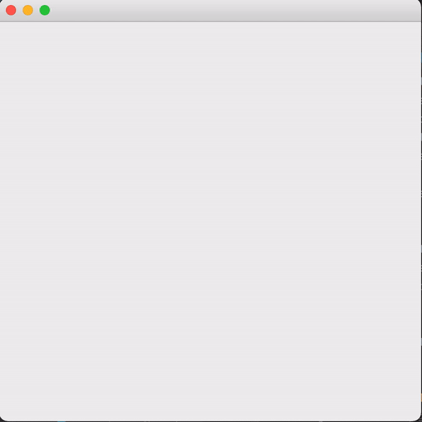

# Group Project COCS 4368 Spring 2021

### TEAM 8 WEZEN

### Members:

Khuong Nguyen - 1880479

David Heller - ID 1468509

Esai Hernandez - ID 1813186

### How to run this project

1. IntelliJ IDE is recommended to open this project
2. The experiments is in Main.java
3. Uncomment the line 61 to run the Wall-E demo. Adjustments to learning rate and discount rate can be done with runDemo(alpha, gamma, policy, learningType) function

_NOTE:_
_The group has 5 people but only 3 people showed up and put effort to get it done. The MIA members are:
Dang Nguyen
Sitting Gou_
